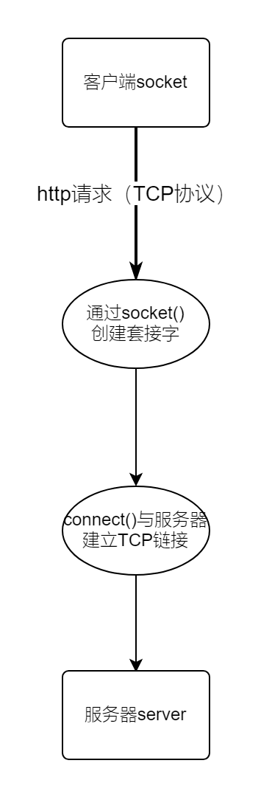
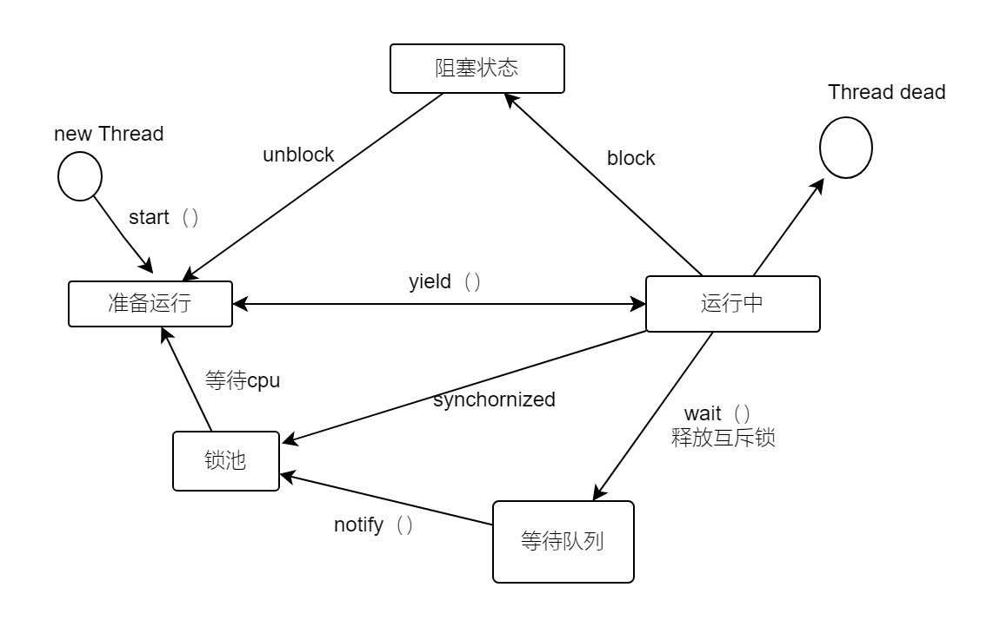

|  PSP2.1  | Personal Software Process Stages  |  预估耗时（分钟）| 实际耗时（分钟）|
|  ----  | ----  |
| Planning |计划| 60|45 |
| · Estimate  | · 估计这个任务需要多少时间|1200 | |
| Development |开发| 1120| |
| · Analysis | ·需求分析 (包括学习新技术)|30 |60 |
|· Design Spec |· 生成设计文档| 30|30 |
| · Design Review |· 设计复审 (和同事审核设计文档)|30 | 30|
| · Coding Standard |· 代码规范 (为目前的开发制定合适的规范)|30 | |
|· Design |· 具体设计|60 | |
| · Coding |· 具体编码| 780| |
| · Code Review |· 代码复审|30 | |
| · Test |· 测试（自我测试，修改代码，提交修改）|30 | |
| Reporting |报告|120 | |
| · Test Report |· 测试报告| 60| |
|· Size Measurement|· 计算工作量| 30| |
| · Postmortem & Process Improvement Plan |· 事后总结, 并提出过程改进计划| 30| |
|  |合计| | |


#软件需求分析

## 需求获取

并发文件下载助手，应该能实现以下功能：

* 单个文件的并发下载（第一阶段完成）
* 多文件的并发下载
* 下载文件时如果因为网络问题重连，资源不会丢失，也就是断点续传


&emsp;实现并发文件下载助手，首先想到了利用python并发编程，之所以要采用并发技术，是因为如果要下载大文件，从网站上下载的时间会非常长，如果能够让程序并发，就能大大缩减下载时间，并且能够同时请求多张图片，目的**解决CPU和网络I/O之间的差距**。  
并发编程的方式有多进程、多线程、异步编程三种方式，本次利用多线程的方式实现异步编程。**多线程方式是抢占式多任务**，最终由操作系统调度。  

并发文件下载助手需要利用到的技术（技术需求）：

* python网络爬虫
* http协议
* TCP/IP协议

##结构化需求分析与建模

&emsp; I/O 密集型最适合使用多线程，能够大量缩短I/O时间。比如要下载多个文件，每次去下载一个文件，就是发起一次 HTTP 请求（使用 TCP 协议），客户端首先通过 socket.socket() 创建一个套接字，**然后调用 connect() 方法经过三次握手与服务端建立 TCP 连接**，这个过程是阻塞的。建立连接后，客户端将请求（文件源）发送给服务端，然后服务端返回响应，客户端用 receive() 方法每次接收一定数量的字节。  
&emsp;网络 I/O 对于 CPU 来说是无比漫长的，如果是依序下载，CPU 就要一直阻塞到第一个文件的字节全部下载完成后，才能下载第二个文件，这会浪费掉大量时间。为了合理利用 CPU 资源，可以使用多线程，每个线程去下载一个文件（或者将一个大文件分割成多个部分，每个线程下载一个部分），当下载第一个文件的任务阻塞时，CPU 切换到第二个线程，它开始下载第二个文件，依次类推，当第一个文件有响应报文到达时，等其它线程阻塞后，CPU 又会切换到下载第一个文件那个线程。  
**整个过程是互斥进行的。**

TCP/IP阶段数据流图





文件传输阶段状态转换图





不知为何markdown语法无法显示图片，这里就用了html语法。


#软件设计

并发文件下载需要利用到网络编程、http协议等方面的知识，在python中有很多相关模块和类可以使用。


* **threading** 模块可以实现多线程，**Queue **模块创建线程级安全的队列，各线程从队列中取任务并执行


&emsp;当我们需要创建多线程时（8个线程），可以像如下使用:
```     
for i in range(8):
    threads = ThreadWorker(queue)
    threads.daemon = True  # 如果工作线程在等待更多的任务时阻塞了，主线程也可以正常退出
    threads.start()  # 启动线程
```


* Requests是用python语言基于urllib编写的，采用的是Apache2 Licensed开源协议的HTTP库，Requests它会比urllib更加方便，可以节约我们大量的工作。

如果要下载一个大文件，像下面的代码
```
 import requests

with requests.get(url) as r:
r.raise_for_status()
with open(filename, 'wb') as fp:
fp.write(r.content)
```

&emsp;客户端发起 HTTP GET 请求后，需要等待整个文件内容全部到达 内核空间 并被内核拷贝到 用户空间 后，用户的下载进程才能解除阻塞状态，并继续将文件内容保存到本地文件中。如果文件非常大，达到了GB级别甚至更大，那么客户端的内存可能不足以缓存文件的全部内容，所以在下载的过程中，用户的下载进程会因为 OOM（out of memory） 被内核 killed。  
&emsp;所以设置 requests.request(method, url, **kwargs) 中的 stream 参数为 True 的话，客户端不会立即下载文件的内容,但客户端与服务端会持续建立 HTTP 连接。
&emsp;再通过 requests.Response.iter_content(chunk_size=1, decode_unicode=False) 指定每次下载的数据块的大小，就可以实现 分块下载，即每次有 chunk_size 大小的数据块到达客户端的内核空间，然后被复制到用户空间后，下载的进程就会解除阻塞状态，并将此 chunk_size 大小的内容保存到本地文件中了。

实现代码如下
```
with requests.get(url, stream=True) as r:
r.raise_for_status()
with open(filename, 'wb') as fp:
for chunk in r.iter_content(chunk_size=512):
if chunk:
fp.write(chunk)
```

* 利用tqdm模块显示下载的进度

```
    from tqdm import tqdm
        with tqdm(total=file_size, unit='B', unit_scale=True, unit_divisor=1024, desc=official_filename) as bar:  # 打印下载时的进度条，并动态显示下载速度
            r = request_('GET', url, stream=True)
            if not r:  # 请求失败时，r 为 None
                return
            with open(temp_filename, 'wb') as fp:
                for chunk in r.iter_content(chunk_size=multipart_chunksize):
                    if chunk:
                        fp.write(chunk)
                        bar.update(len(chunk))

```
其中unit = 'B'是指按Byte来计算，unit_scale = True 表示会自动拓展单位，

* 利用click快速创建命令行选项与参数

```
@click.command()
@click.option('--dest_filename', type=click.Path(), help="Name of the local destination file with extension")
@click.option('--multipart_chunksize', default=8*1024*1024, help="Size of chunk, unit is bytes")
@click.argument('url', type=click.Path())
```
可选的命令行选项 --dest_filename、--multipart_chunksize和必填的命令行参数 url。


* 断点续传
  
1. Range 

**HTTP/1.1 RFC 2616** 开始支持 Range，客户端只需要在 HTTP 的 请求头部 中添加 Range: bytes=[start]-[stop] 即可


