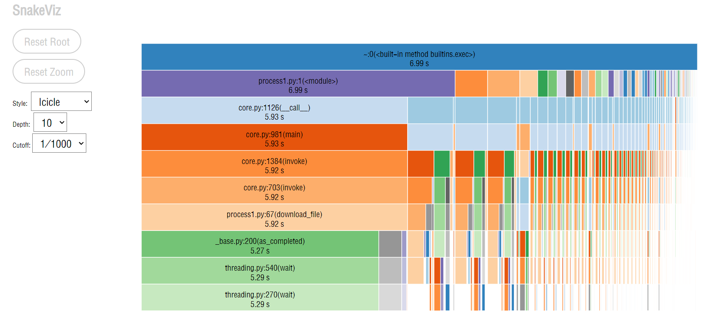

|  PSP2.1  | Personal Software Process Stages  |  预估耗时（分钟）| 实际耗时（分钟）|
|  ----  | ----  |
| Planning |计划| 60|45 |
| · Estimate  | · 估计这个任务需要多少时间|1200 | |
| Development |开发| 1120| |
| · Analysis | ·需求分析 (包括学习新技术)|30 |60 |
|· Design Spec |· 生成设计文档| 30|30 |
| · Design Review |· 设计复审 (和同事审核设计文档)|30 | 30|
| · Coding Standard |· 代码规范 (为目前的开发制定合适的规范)|30 | |
|· Design |· 具体设计|60 | |
| · Coding |· 具体编码| 780| |
| · Code Review |· 代码复审|30 | |
| · Test |· 测试（自我测试，修改代码，提交修改）|30 | |
| Reporting |报告|120 | |
| · Test Report |· 测试报告| 60| |
|· Size Measurement|· 计算工作量| 30| |
| · Postmortem & Process Improvement Plan |· 事后总结, 并提出过程改进计划| 30| |
|  |合计| | |


#软件需求分析

## 需求获取

并发文件下载助手，应该能实现以下功能：

* 单个文件的并发下载（第一阶段完成）
* 多文件的并发下载
* 下载文件时如果因为网络问题重连，资源不会丢失，也就是断点续传
* 多个文件批量下载
* 多协议下载（除支持http/https协议外，也能够支持如ftp, bittorrent，磁力链等）
* 支持使用正则表达式来生成多个下载地址


&emsp;实现并发文件下载助手，首先想到了利用python并发编程，之所以要采用并发技术，是因为如果要下载大文件，从网站上下载的时间会非常长，如果能够让程序并发，就能大大缩减下载时间，并且能够同时请求多张图片，目的**解决CPU和网络I/O之间的差距**。  
并发编程的方式有多进程、多线程、异步编程三种方式，本次利用多线程的方式实现异步编程。**多线程方式是抢占式多任务**，最终由操作系统调度。  

并发文件下载助手需要利用到的技术（技术需求）：

* python网络编程
* http/https协议
* TCP/IP协议
* 多线程

##结构化需求分析与建模

&emsp; I/O 密集型最适合使用多线程，能够大量缩短I/O时间。比如要下载多个文件，每次去下载一个文件，就是发起一次 HTTP 请求（使用 TCP 协议），客户端首先通过 socket.socket() 创建一个套接字，**然后调用 connect() 方法经过三次握手与服务端建立 TCP 连接**，这个过程是阻塞的。建立连接后，客户端将请求（文件源）发送给服务端，然后服务端返回响应，客户端用 receive() 方法每次接收一定数量的字节。  
&emsp;网络 I/O 对于 CPU 来说是无比漫长的，如果是依序下载，CPU 就要一直阻塞到第一个文件的字节全部下载完成后，才能下载第二个文件，这会浪费掉大量时间。为了合理利用 CPU 资源，可以使用多线程，每个线程去下载一个文件（或者将一个大文件分割成多个部分，每个线程下载一个部分），当下载第一个文件的任务阻塞时，CPU 切换到第二个线程，它开始下载第二个文件，依次类推，当第一个文件有响应报文到达时，等其它线程阻塞后，CPU 又会切换到下载第一个文件那个线程。  
**整个过程是互斥进行的。**

TCP/IP阶段数据流图


文件传输阶段状态转换图


不知为何markdown语法无法显示图片，这里就用了html语法。


#软件设计

并发文件下载需要利用到网络编程、http协议等方面的知识，在python中有很多相关模块和类可以使用。


* **threading** 模块可以实现多线程，**Queue **模块创建线程级安全的队列，各线程从队列中取任务并执行


&emsp;当我们需要创建多线程时（8个线程），可以像如下使用:
```     
for i in range(8):
    threads = ThreadWorker(queue)
    threads.daemon = True  # 如果工作线程在等待更多的任务时阻塞了，主线程也可以正常退出
    threads.start()  # 启动线程
```


* Requests是用python语言基于urllib编写的，采用的是Apache2 Licensed开源协议的HTTP库，Requests它会比urllib更加方便，可以节约我们大量的工作。

如果要下载一个大文件，像下面的代码
```
 import requests

with requests.get(url) as r:
r.raise_for_status()
with open(filename, 'wb') as fp:
fp.write(r.content)
```

&emsp;客户端发起 HTTP GET 请求后，需要等待整个文件内容全部到达 内核空间 并被内核拷贝到 用户空间 后，用户的下载进程才能解除阻塞状态，并继续将文件内容保存到本地文件中。如果文件非常大，达到了GB级别甚至更大，那么客户端的内存可能不足以缓存文件的全部内容，所以在下载的过程中，用户的下载进程会因为 OOM（out of memory） 被内核 killed。  
&emsp;所以设置 requests.request(method, url, **kwargs) 中的 stream 参数为 True 的话，客户端不会立即下载文件的内容,但客户端与服务端会持续建立 HTTP 连接。
&emsp;再通过 requests.Response.iter_content(chunk_size=1, decode_unicode=False) 指定每次下载的数据块的大小，就可以实现 分块下载，即每次有 chunk_size 大小的数据块到达客户端的内核空间，然后被复制到用户空间后，下载的进程就会解除阻塞状态，并将此 chunk_size 大小的内容保存到本地文件中了。

实现代码如下
```
with requests.get(url, stream=True) as r:
r.raise_for_status()
with open(filename, 'wb') as fp:
for chunk in r.iter_content(chunk_size=512):
if chunk:
fp.write(chunk)
```

* 利用tqdm模块显示下载的进度

```
    from tqdm import tqdm
        with tqdm(total=file_size, unit='B', unit_scale=True, unit_divisor=1024, desc=official_filename) as bar:  # 打印下载时的进度条，并动态显示下载速度
            r = request_('GET', url, stream=True)
            if not r:  # 请求失败时，r 为 None
                return
            with open(temp_filename, 'wb') as fp:
                for chunk in r.iter_content(chunk_size=multipart_chunksize):
                    if chunk:
                        fp.write(chunk)
                        bar.update(len(chunk))

```
其中unit = 'B'是指按Byte来计算，unit_scale = True 表示会自动拓展单位，

* 利用click快速创建命令行选项与参数

```
@click.command()
@click.option('--dest_filename', type=click.Path(), help="Name of the local destination file with extension")
@click.option('--multipart_chunksize', default=8*1024*1024, help="Size of chunk, unit is bytes")
@click.argument('url', type=click.Path())
```
可选的命令行选项 --dest_filename、--multipart_chunksize和必填的命令行参数 url。


* 断点续传
  
1.Range 

**HTTP/1.1 RFC 2616** 开始支持 Range，客户端只需要在 HTTP 的 headers 中添加 Range: bytes=[start]-[stop] 即可

如果服务器能够正常响应的话，服务器会返回 206 Partial Content 的状态码及说明.

如果不能处理这种Range的话，就会返回整个资源以及响应状态码为 200 OK .（要分段下载时，要先判断这个）

2.ETag

Last-Modified 和 ETag 用来标记此文件是否被修改过，比如上次请求此文件时 ETag: "5d52d17f-264"，然后因为网络原因失败了（已下载完 0-499 字节），现在如果想继续从 500 字节往后下载的话，首先需要判断文件在这段时间内是否有修改过，就是比较两次的 Last-Modified 和 ETag。如果不一致，则说明文件被修改过，需要从头开始下载，而不能使用断点续传.

* 同步锁  lock

Python 的 threading 模块引入了锁（Lock），每个lock有两个方法： 加锁acquire（），释放锁release（），合理利用锁能够实现线程之间的互斥执行。


* concurrent.furture


concurrent.futures模块，可以利用multiprocessing实现真正的平行计算。

核心原理是：concurrent.futures会以子进程的形式，平行的运行多个python解释器，从而令python程序可以利用多核CPU来提升执行速度。由于子进程与主解释器相分离，所以他们的全局解释器锁也是相互独立的。每个子进程都能够完整的使用一个CPU内核。

       with futures.ThreadPoolExecutor(workers) as executor:
            to_do = []
            # 创建并排定Future
            for part_number in parts:
                # 通过块号计算出块的起始与结束位置，最后一块(编号从0开始，所以最后一块编号为 parts_count - 1)需要特殊处理
                if part_number != parts_count-1:
                    start = part_number * multipart_chunksize
                    stop = (part_number + 1) * multipart_chunksize - 1
                else:
                    start = part_number * multipart_chunksize
                    stop = file_size - 1
                future = executor.submit(_fetchByRange_partial, part_number, start, stop)
                to_do.append(future)

            # 获取Future的结果，futures.as_completed(to_do)的参数是Future列表，返回迭代器，
            # 只有当有Future运行结束后，才产出future
            done_iter = futures.as_completed(to_do)


#性能检测

* 用python profile进行性能分析
首先编译生成.cprofile文件
    
```
python3 -m cProfile -o process1.cprofile  process1.py

```
然后用pstats表格分析
```
  210871 function calls (204637 primitive calls) in 6.991 seconds

   Ordered by: cumulative time, function name
   List reduced from 2144 to 30 due to restriction <30>

   ncalls  tottime  percall  cumtime  percall filename:lineno(function)
    209/1    0.003    0.000    6.991    6.991 {built-in method builtins.exec}
        1    0.000    0.000    6.991    6.991 process1.py:1(<module>)
        1    0.000    0.000    5.929    5.929 core.py:1126(__call__)
        1    0.000    0.000    5.929    5.929 core.py:981(main)
        1    0.000    0.000    5.922    5.922 core.py:1384(invoke)
        1    0.000    0.000    5.922    5.922 core.py:703(invoke)
        1    0.001    0.001    5.922    5.922 process1.py:67(download_file)
       15    0.000    0.000    5.286    0.352 threading.py:540(wait)
      141    5.286    0.037    5.286    0.037 {method 'acquire' of '_thread.lock' objects}
       22    0.000    0.000    5.286    0.240 threading.py:270(wait)
        8    0.000    0.000    5.274    0.659 _base.py:200(as_completed)
   234/11    0.003    0.000    1.197    0.109 <frozen importlib._bootstrap>:986(_find_and_load)
   233/11    0.002    0.000    1.196    0.109 <frozen importlib._bootstrap>:956(_find_and_load_unlocked)
   217/11    0.002    0.000    1.151    0.105 <frozen importlib._bootstrap>:650(_load_unlocked)
   185/11    0.002    0.000    1.150    0.105 <frozen importlib._bootstrap_external>:842(exec_module)
   273/11    0.000    0.000    1.130    0.103 <frozen importlib._bootstrap>:211(_call_with_frames_removed)
       13    0.001    0.000    0.817    0.063 __init__.py:1(<module>)
        1    0.000    0.000    0.723    0.723 request_.py:1(<module>)
        1    0.000    0.000    0.718    0.718 __init__.py:8(<module>)
  229/194    0.003    0.000    0.693    0.004 <frozen importlib._bootstrap>:890(_find_spec)
    42/18    0.000    0.000    0.651    0.036 {built-in method builtins.__import__}
     1000    0.598    0.001    0.598    0.001 {built-in method nt.stat}
      984    0.002    0.000    0.596    0.001 <frozen importlib._bootstrap_external>:135(_path_stat)
   107/59    0.000    0.000    0.562    0.010 <frozen importlib._bootstrap>:1017(_handle_fromlist)
      211    0.001    0.000    0.557    0.003 <frozen importlib._bootstrap_external>:1399(find_spec)
      211    0.003    0.000    0.556    0.003 <frozen importlib._bootstrap_external>:1367(_get_spec)
      519    0.011    0.000    0.523    0.001 <frozen importlib._bootstrap_external>:1498(find_spec)
        2    0.000    0.000    0.508    0.254 request_.py:4(request_)
        2    0.000    0.000    0.508    0.254 api.py:16(request)
        2    0.000    0.000    0.504    0.252 sessions.py:457(request)

```
* snakevie图形化展示


```
python -m snakeviz process1.cprofile
```



* 实现多文件下载


```
def download(config='config.json'):
    '''多线程并发下载多个大文件'''
    # 读取包含多个大文件相关信息(url、dest_filename、multipart_chunksize)的配置文件 config.json
    with open(config, 'r') as fp:
        cfg = json.load(fp)
        urls = [f['url'] for f in cfg['files']]
        dest_filenames = [f['dest_filename'] for f in cfg['files']]
        multipart_chunksizes = [f['multipart_chunksize'] for f in cfg['files']]

    # 多线程并发下载
    workers = min(8, len(cfg['files']))
    with futures.ThreadPoolExecutor(workers) as executor:
        executor.map(_fetchOneFile, urls, dest_filenames, multipart_chunksizes)  # 给 Executor.map() 传多个序列


```
* 关于tqdm多行显示异常的问题 

  参考博客https://my.oschina.net/u/4013710/blog/3103196
  通过查tqdm的官方文档，假如参数position=0可以避免进度条出现多行的情况。


* 实现ftp协议下载

 关于ftp协议：  

  FTP(File Transfer Protocol，文件传输协议) 是TCP/IP协议组中的协议之一。
  FTP协议包括两个组成部分，其一为FTP服务器，其二为FTP客户端。其中FTP服务器用来存储文件，用户可以使用FTP客户端通过FTP协议访问位于FTP服务器上的资源。
  默认情况下FTP协议使用TCP端口中的 20和21这两个端口，其中20用于传输数据，21用于传输控制信息。

  python中默认安装的ftplib模块定义了FTP类，可用来实现简单的ftp客户端，用于上传或下载ftp服务器上的文件。


```
from ftplib import FTP            # 导入ftplib模块
ftp=FTP()                         # 获取ftp变量
ftp.set_debuglevel(2)             # 打开调试级别2，显示详细信息
ftp.connect("host","port")          #连接的ftp sever服务器
ftp.login("usrname","password")      # 用户登陆
print(ftp.getwelcome())            # 打印欢迎信息
ftp.cmd("xxx/xxx")                # 进入远程目录
ftp.retrbinaly("RETR filename.txt",file_handle,bufsize) # 接收服务器上文件并写入本地文件
ftp.set_debuglevel(0)             #关闭调试模式
ftp.quit()                        #退出ftp

ftp.cwd(ftppath)                 # 设置ftp当前操作的路径
ftp.dir()                         # 显示目录下所有文件信息
ftp.nlst()                        # 获取目录下的文件，返回一个list
ftp.mkd(pathname)                 # 新建远程目录
ftp.pwd()                         # 返回当前所在路径
ftp.rmd(dirname)                  # 删除远程目录
ftp.delete(filename)              # 删除远程文件
ftp.rename(fromname, toname) # 将fromname修改名称为toname。
ftp.storbinaly("STOR filename.txt",fid,bufsize)  # 上传目标文件
ftp.retrbinary("RETR filename.txt",fid,bufsize)  # 下载FTP文件
```


